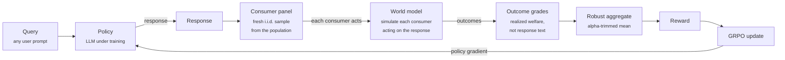

# rldf

> **Reinforcement Learning from Downstream Feedback (RLDF).** Extend RLVR past math and code by grading the realized consequence of acting on a response, aggregated over a population of simulated consumers and read out through a robust aggregator.
>
> [Read the proof (PDF)](https://aryan-cs.github.io/rldf/proof.pdf) · [Read the plan](docs/PLAN.md) · [Source on GitHub](https://github.com/aryan-cs/rldf)

This repository hosts the formal theory and the research plan for RLDF. The theory develops a welfare-consistency theorem for consequence-graded policy optimization and recovers RLVR as a degenerate special case. The plan specifies the experimental programme that tests it. Implementation follows.

---

## In simple terms

The trick behind today's best reasoning models only works when an answer can be checked against a key, like a math result or code that either passes its tests or does not. Most real questions, like whether to take a job, have no key, so that approach does not apply.

RLDF judges the model by what happens next instead. It simulates a crowd of different people following the model's advice and rewards an answer by whether those people end up better off. An answer that only sounds good, by flattering the user or making something up, leads to bad outcomes once people act on it, so it scores low and the model learns to avoid it.

A simulated crowd can be gamed if some of its members are easy to fool, so RLDF throws out the most extreme reactions and always tests on a fair sample of the crowd. We prove this keeps the model honest as long as the share of foolable members stays small enough.

---

## What is RLDF, in one paragraph?

Reinforcement learning with verifiable rewards (RLVR) works because the grader is incorruptible and independent of the policy being trained: a math answer is checked against a key, a patch against a test suite. That is also its boundary. Most queries have no key, and the usual repair, a learned reward model that scores the response, brings back the corruptibility the verifier removed and produces sycophancy and confident hallucination. RLDF changes what is graded. Instead of scoring the response, it simulates what happens after a user acts on the response and grades the realized outcome, aggregated over a population of simulated consumers through an alpha-trimmed mean. A response that merely looks good scores well to a response grader but poorly once a consumer acts on it. The reward is fed to the same policy-gradient optimizer RLVR uses, and RLVR is recovered as the case of a single consumer with a deterministic, perfectly verified outcome.

---

## Why this matters

If the thesis holds:

1. **Verifiability extends to a new layer.** For a large class of advisory tasks the outcome of acting on a response is mechanically scorable even when the response is open-ended natural language. A code change is free-form text, but whether it passes the test suite is a fixed, policy-independent check. On such tasks RLDF inherits RLVR-grade robustness where response-grading methods do not.
2. **Sycophancy and hallucination are penalized at the source.** A flattering or confidently wrong answer wins approval but loses on the outcome a consumer realizes. Grading the outcome removes the persuasion bias that response-grading rewards.
3. **The gameability failure is met with a guarantee.** Optimizing against simulated users is the procedure shown to manufacture targeted manipulation of a vulnerable minority. RLDF answers it with a robust aggregator and representative panels, and the guarantee is a welfare-consistency theorem with a sharp contamination threshold.

The work sits at the intersection of three lines that each reach part of the target:

- **Hindsight simulation.** RLHS (Liang et al., arXiv:2501.08617) grades simulated downstream outcomes, but through a single judge persona, with no robustness analysis.
- **Economic and agent-society sandboxes.** MALLES (arXiv:2603.17694) and AgentSociety (arXiv:2502.08691) build heterogeneous populations, but the LLMs are the consumers and the signal is a stated preference; no advisor is trained.
- **Outcome-rewarded agents.** WebRL (arXiv:2411.02337) trains a policy on a realized outcome, but collapses it to a single success bit.

> **On the threat model.** Williams and Carroll (arXiv:2411.02306) show that optimizing against simulated user feedback makes a model learn to identify and manipulate even a 2% vulnerable minority while behaving correctly for everyone else. This is the central hazard the method must survive. The proof treats it directly: trimming bounds an unstructured minority, and representative panels are what stop a targeting adversary, with sharpness shown at the breakdown point.

The formal development is in [`proof.pdf`](https://aryan-cs.github.io/rldf/proof.pdf).

---

## The training loop



| Component | Role |
|-----------|------|
| **Policy** (LLM) | Emits the response to each query. The model being trained. |
| **Consumer panel** | A fresh independent sample of simulated users from the population for the query. Independence is what blocks a targeting adversary. |
| **World model** | Simulates the outcome of each consumer acting on the response. |
| **Outcome grader** | Scores the realized outcome by welfare or regret, not the response text. |
| **Robust aggregate** | Combines the panel grades with an alpha-trimmed mean, discarding the extremes so a corruptible minority cannot move the price. |
| **Optimizer** (GRPO) | Ascends the robust reward, as RLVR ascends a verifier score. |

The corruption parameter is zero when the world model and grader are a fixed program (the verifiable regime) and positive when they are a learned model (the simulated regime). The robust aggregator and the representative panel do, in the simulated regime, the work that policy-independence does for free in the verifiable regime.

---

## The empirical programme

Three demonstrations, each isolating one ingredient.

| Demonstration | What is tested | Headline claim |
|---------------|----------------|----------------|
| **Verifiable regime** | Whether a policy-independent outcome signal is harder to game than an LLM judge on the same tasks. | Matches RLVR-grade robustness on tasks whose response has no verifier, where judge-based RL is Goodharted. |
| **Simulated regime** | Population plus robust aggregation against a single hindsight judge (RLHS), on shared consultancy tasks. | Higher realized welfare than RLHS at equal in-domain accuracy; ablations attribute the gain to the population and the signal. |
| **Gameability stress test** | Whether trimming and representative panels defeat targeted manipulation as the gameable fraction is swept. | Manipulation is suppressed below the trimming level and reappears above it, and the empirical threshold tracks the closed-form one. |

The full design, baselines, ablations, metrics, and falsification criteria are in [`PLAN.md`](docs/PLAN.md).

---

## Repository layout

```
rldf/
├── README.md            <- you are here (repo landing page)
└── docs/                <- everything served by GitHub Pages
    ├── PLAN.md          <- the research plan (canonical proposal)
    ├── proof.tex        <- formal theory (LaTeX source)
    ├── proof.pdf        <- compiled theory PDF (served at /proof.pdf)
    └── .nojekyll        <- serve files as-is, no Jekyll processing
```

The proof PDF is served at `https://aryan-cs.github.io/rldf/proof.pdf` and is committed so casual readers need no LaTeX toolchain.

When code lands, the expected structure is:

```
rldf/
├── rldf/                <- Python package
│   ├── policy/          <- the trained-policy wrapper and GRPO loop
│   ├── world_model/     <- consumer simulator and outcome evaluator
│   ├── population/      <- consumer-type sampling and panel construction
│   ├── reward/          <- outcome grading and robust aggregation
│   └── verifiers/       <- programmatic outcome checks for the verifiable regime
├── tasks/
│   ├── verifiable/      <- code, tool-use, scheduling environments
│   └── simulated/       <- advising and recommendation environments
├── experiments/         <- training, ablation, and stress-test scripts
└── tests/
```

---

## How to read the documents

In order:

1. **[README.md](README.md)** *(this file)*. Orientation.
2. **[PLAN.md](docs/PLAN.md)**. The research plan: thesis, the two task regimes, baselines and ablations, the gameability stress test, success and falsification criteria, and open problems.
3. **[proof.pdf](https://aryan-cs.github.io/rldf/proof.pdf)**. The formal theory. The foresight-hindsight gap, finite-population concentration, the gameability threshold, the robust-aggregation ranking guarantee and main theorem, then the extensions: approximate calibration, training-loop regret, and the per-distribution bound with its sharpness result.

If you read two sections of the proof, read the main theorem (welfare-consistency of robust RLDF) and the section on the gameability threshold.

---

## Building the proof PDF

The proof compiles cleanly with [Tectonic](https://tectonic-typesetting.github.io/), which downloads required packages on first use.

```bash
# install once
brew install tectonic           # macOS, or follow the instructions for your platform

# compile
cd docs
tectonic proof.tex
```

This produces `docs/proof.pdf`. A `latexmk` toolchain works equivalently:

```bash
cd docs && latexmk -pdf proof.tex
```

---

## Status

| Milestone | State |
|-----------|-------|
| Formal theory: welfare-consistency of robust RLDF, RLVR as a special case | ✅ done |
| Extensions: approximate calibration, training-loop regret, per-distribution bound, sharpness | ✅ done |
| Research plan and empirical design | ✅ done |
| Verifiable-regime pilot | ⏳ pending |
| World model and consumer population | ⏳ pending |
| Aggregation, population, panel, and signal ablations | ⏳ pending |
| Gameability stress test | ⏳ pending |
| Head-to-head against RLHS | ⏳ pending |

---

## A note on framing

RLDF makes a claim about what is graded, not about scale. The reward is verifiable-grade only where the outcome pipeline is policy-independent; elsewhere it inherits the reliability of its world model: calibration on the faithful majority is the assumption everything rests on, and no aggregator recovers welfare if it fails. The robust aggregator weakens that requirement from calibrated everywhere to calibrated on a majority, and no further.

If you are a reviewer or collaborator, the right places to push back are: the calibration assumption and whether a simulator can meet it; whether the verifiable regime is harder to game than a judge; and whether realized-welfare grading reduces hallucination as well as sycophancy. The experiments that would settle these have not yet been run.

---

## Citation

A preprint will follow the empirical results. For now, please cite the repository:

```
@misc{rldf2026,
  title  = {Reinforcement Learning from Downstream Feedback: Training Language Models on the Consequences of Their Answers},
  author = {Aryan Gupta},
  year   = {2026},
  note   = {\url{https://github.com/aryan-cs/rldf}}
}
```

---

## License

The writeup, formal proof, experimental plan, and all documents in this repository are licensed under [Creative Commons Attribution-NonCommercial-NoDerivatives 4.0 International (CC BY-NC-ND 4.0)](https://creativecommons.org/licenses/by-nc-nd/4.0/). You may read and share with attribution; commercial use, derivative works, translations, condensations, and inclusion in training data require explicit prior written permission from the author. See [LICENSE](LICENSE) for the binding terms.

When experimental code is released, it will carry a separate software license in its own directory; the documents in this repository remain under CC BY-NC-ND 4.0.

For permission requests outside the terms of the license, contact `aryan.cs.app@gmail.com`.
